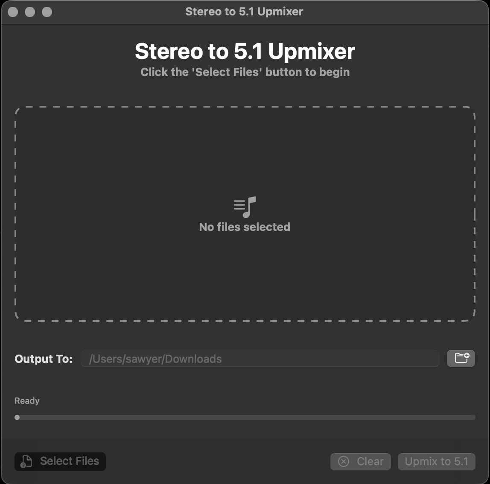

# Stereo Upmixer Suite

A powerful, native macOS application that transforms stereo audio files into immersive surround sound formats including 5.1, 7.1 PCM, DTS Master Audio, and Dolby Atmos.

<p align="center">
  
</p>

<p align="center">
  
  
  
  
  <a href="https://github.com/dunamismax/Swift/releases"></a>
  <a href="https://github.com/dunamismax/Swift/blob/main/LICENSE"></a>
</p>

## Features

### Audio Format Support
- **5.1 Surround** - Classic cinema surround sound
- **7.1 PCM** - Extended surround for premium home theaters
- **DTS Master Audio** - Lossless audio for audiophiles
- **Dolby Atmos** - Object-based 3D spatial audio

### Interface
- **Drag & Drop** - Simply drag audio files or folders directly into the app window
- **Smart Detection** - Automatically discovers audio files in dropped folders
- **Real-Time Progress** - Live status tracking for each file
- **Batch Processing** - Process multiple files simultaneously
- **Format Selection** - Easy dropdown to choose your desired output format

### Technical
- **Native macOS Design** - Built with SwiftUI for optimal performance
- **Security-First** - Sandboxed app with proper file access permissions
- **Self-Contained** - No external dependencies, FFmpeg is bundled
- **Cancellable Operations** - Stop processing at any time
- **Error Handling** - Clear, helpful error messages

## Download & Install

### Option 1: Download Release (Recommended)
1. Visit the [GitHub Releases](https://github.com/dunamismax/Swift/releases) page
2. Download the latest `Stereo-Upmixer-Suite.dmg` file
3. Double-click the DMG and drag the app to your Applications folder
4. Launch Stereo Upmixer Suite from Applications

### Option 2: Build from Source
See the [Building from Source](#building-from-source) section below.

## How to Use

1. **Launch** Stereo Upmixer Suite
2. **Add Files** - Click "Select Files" or drag audio files/folders into the window
3. **Choose Output** - Click "Output To" and select your destination folder
4. **Pick Format** - Use the dropdown to select your desired surround format
5. **Process** - Click "Upmix to [Format]" and monitor progress

### Supported Formats

**Input:** MP3, WAV, FLAC, AAC, M4A, OGG, WMA, AIFF, AU (any format supported by FFmpeg)

**Output:**
- 5.1 Surround: `filename_5.1.flac`
- 7.1 PCM: `filename_7.1.flac`
- DTS Master Audio: `filename_DTS-MA.dts`
- Dolby Atmos: `filename_Atmos.flac`

## Playback Requirements

### Media Players
- **VLC Media Player** (recommended) - Excellent multi-channel support
- **IINA** - Native macOS player with surround support
- **Kodi** - Home theater software
- **Plex** - Media server with surround passthrough

### Audio Hardware
- **5.1/7.1 Systems** - A/V receiver with appropriate speaker configuration
- **Headphones** - Compatible headphones with virtual surround processing
- **Dolby Atmos** - Atmos-enabled receiver and speaker setup (for Atmos files)

## Building from Source

### Prerequisites
- Xcode 15.0+
- macOS 15.5+
- Apple Developer Account (for signing)

### Build Steps
1. **Clone the Repository**
   ```bash
   git clone https://github.com/dunamismax/Swift.git
   cd "Swift/Projects/Stereo-Upmixer-Suite"
   ```

2. **Open in Xcode**
   ```bash
   open "Stereo Upmixer Suite.xcodeproj"
   ```

3. **Configure Signing**
   - Select the project in Navigator
   - Go to "Signing & Capabilities" tab
   - Choose your development team

4. **Build & Run**
   - Select "Stereo Upmixer Suite" scheme
   - Choose "My Mac" destination
   - Press `Cmd+R` to build and run

## Updating FFmpeg

The app includes a bundled FFmpeg binary for audio processing. To update to the latest version:

### Automatic Update (Recommended)
```bash
# Navigate to your project directory
cd "/path/to/Stereo-Upmixer-Suite"

# Backup current version
cp ffmpeg ffmpeg.backup

# Download latest FFmpeg for macOS ARM64
curl -s "https://ffmpeg.martin-riedl.de/redirect/latest/macos/arm64/snapshot/ffmpeg.zip" -L -o /tmp/ffmpeg-latest.zip

# Extract and install
cd /tmp && unzip -q ffmpeg-latest.zip
cp ffmpeg "/path/to/Stereo-Upmixer-Suite/" && chmod +x "/path/to/Stereo-Upmixer-Suite/ffmpeg"

# Verify installation
./ffmpeg -version

# Clean up
rm /tmp/ffmpeg /tmp/ffmpeg-latest.zip
```

### Manual Update
1. Visit [Martin Riedl's FFmpeg Build Server](https://ffmpeg.martin-riedl.de/)
2. Download the latest macOS ARM64 snapshot build
3. Replace the `ffmpeg` binary in your project folder
4. Set executable permissions: `chmod +x ffmpeg`

## Project Structure

```
Stereo-Upmixer-Suite/
├── Stereo Upmixer Suite/
│   ├── UpmixerApp.swift           # App entry point
│   ├── UpmixView.swift            # Main UI with drag & drop
│   ├── AudioUpmixer.swift         # Core processing logic
│   └── Assets.xcassets/           # App icons and assets
├── Stereo Upmixer Suite.xcodeproj # Xcode project
├── ffmpeg                         # FFmpeg binary (ARM64)
├── ffmpeg.backup                  # Backup of previous version
└── README.md                      # This file
```

## Troubleshooting

### Common Issues

**"Cannot verify developer" error**
- Right-click the app → "Open" → "Open" again
- Or go to System Preferences → Security & Privacy → Allow

**No output files generated**
- Check that output directory is writable
- Verify input files are valid audio formats
- Check the app's error messages

**App crashes on launch**
- Ensure you're running macOS 15.5 or later
- Try rebuilding from source with your developer certificate

**Poor surround quality**
- The app creates "upmixed" surround from stereo sources
- For true surround, use source material recorded in surround formats
- Consider the limitations of stereo-to-surround conversion

### Getting Help
- Check [Issues](https://github.com/dunamismax/Swift/issues) for known problems
- Create a new issue with detailed information
- Include system info, error messages, and steps to reproduce

## Contributing

Help make Stereo Upmixer Suite even better:

- **Report Bugs** - [Open an issue](https://github.com/dunamismax/Swift/issues) with detailed reproduction steps
- **Suggest Features** - [Start a discussion](https://github.com/dunamismax/Swift/discussions) with your ideas
- **Submit Code** - Fork, improve, and [create a pull request](https://github.com/dunamismax/Swift/pulls)
- **Improve Documentation** - Help make our guides clearer and more comprehensive

### Development Guidelines
- Follow Swift coding conventions
- Test on multiple macOS versions when possible
- Update documentation for new features
- Include clear commit messages

## Connect & Support

**Get in Touch:**
- Twitter: [@dunamismax](https://twitter.com/dunamismax)
- Bluesky: [@dunamismax.bsky.social](https://bsky.app/profile/dunamismax.bsky.social)
- Reddit: [u/dunamismax](https://www.reddit.com/user/dunamismax)
- Discord: `dunamismax`
- Signal: `dunamismax.66`

**Show Your Support:**
- Star this repository
- Share on social media
- Write a review or blog post

## License

This project is licensed under the **MIT License** - see the [LICENSE](LICENSE) file for details.

**Copyright © 2025 dunamismax**

---

<p align="center">
  <strong>Transform Your Audio • Experience True Surround Sound • Built for macOS</strong>
</p>